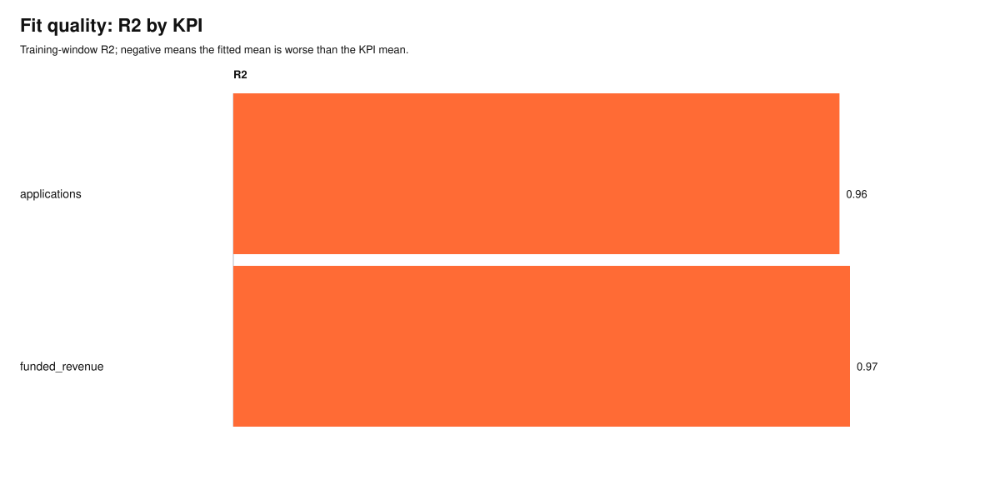
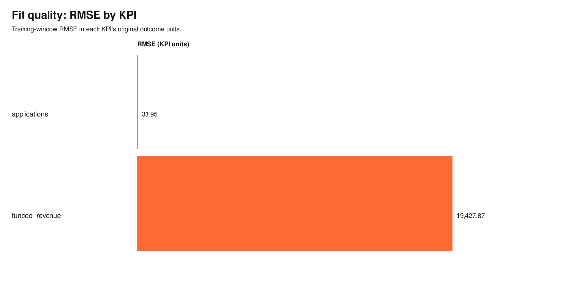

# calmmm

Calibrated Hierarchical Bayesian Media Mix Model.

`calmmm` is a Python package for measuring marketing effectiveness across geographies and KPIs. It fits a Bayesian MMM with geo-pooled channel effects, multiple outcome likelihoods, and optional lift-based calibration from incrementality experiments.

## Features

- **Hierarchical geo×KPI pooling** — channel effects share strength across geos and KPIs via a three-level non-centered hierarchy.
- **Flexible adstock & saturation** — geometric adstock decay and Hill saturation curves, all differentiable via PyTensor.
- **Multi-KPI support** — Gaussian, log-normal, negative binomial, and binomial observation likelihoods per KPI.
- **Incrementality calibration** — anchors channel contributions to lift measurements from geo experiments.
- **Channel interactions** — optional directed graph of multiplicative boosts between channels (e.g. direct mail lifting branded search), fit as extra `gamma` parameters alongside the rest of the model.
- **Three inference modes** — full MCMC (`sample`), mean-field VI (`vi`), and MAP estimation (`map`).
- **Attribution & ROI** — counterfactual channel contributions, ROI by channel/KPI, and Hill saturation curves.

## Installation

```bash
# requires Python ≥ 3.10
pip install -e .          # editable install from source
# or with uv:
uv sync
```

Dependencies: `pymc>=5`, `pytensor>=2.18`, `numpy>=1.24`, `pandas>=2.0`, `scipy>=1.10`, `arviz>=0.16`.

## Quick start

```python
import pandas as pd
from calmmm import MMMData, HierarchicalMMM

# 1. Load your weekly data (one row per time × geo)
df = pd.read_csv("marketing_data.csv")

# 2. Wrap in MMMData
data = MMMData.from_dataframe(
    df,
    time="week",
    geo="region",
    kpis=["revenue", "orders"],
    media=["tv", "search", "social"],
    spend=["tv_spend", "search_spend", "social_spend"],
    kpi_likelihoods={"revenue": "gaussian", "orders": "negative_binomial"},
)

# 3. Fit (MAP for speed; use mode="sample" for full posteriors)
mmm = HierarchicalMMM()
fit = mmm.fit(data, mode="map")

# 4. Attribution
from calmmm.attribution.contributions import channel_contributions
from calmmm.attribution.roi import compute_roi

contribs = channel_contributions(fit)
roi = compute_roi(fit)
print(roi)
```

## Reporting Preview

`calmmm` can render report-ready SVGs from demo or production fit outputs. The generated charts keep the model artifacts auditable while giving stakeholders a quick read on response curves, ROI, calibration fit, fit quality, and spend scenarios.
The same demo output includes `fit_quality.csv` with RMSE/R2 and `mcmc_diagnostics.csv` with R-hat/ESS diagnostics for posterior fits. `mcmc_diagnostics.csv` is only rendered when the fit has posterior samples (`mode="sample"` or `mode="vi"`); MAP fits skip it since there is nothing to diagnose.

| Saturation curves | ROI by KPI and channel |
|---|---|
|  |  |

| R2 by KPI | RMSE by KPI |
|---|---|
|  |  |

See the [User Guide](docs/user_guide.md#7-reporting-visuals) for the full reporting workflow and additional plots.

## Tests

```bash
# fast tests only (default — skips PyMC inference)
pytest

# include slow inference tests
pytest -m ""
```

## Package layout

```
calmmm/
  data/          # MMMData, IncrementalityTests, schema enums
  model/         # HierarchicalMMM, MMMFit, PriorConfig, PyMC components
  transforms/    # adstock, Hill saturation, I-spline, Fourier, MediaScaler
  calibration/   # CalibrationTarget, calibration likelihood, lift computation
  attribution/   # channel contributions, ROI, saturation curves
```

## Documentation

- [User Guide](docs/user_guide.md) — full workflow with data prep, priors, calibration, and attribution.
- [End-to-End Workflow](docs/end_to_end_workflow.md) — flow and sequence diagrams connecting data, model, attribution, and reporting.
- [Deployment Guide](docs/deployment_guide.md) — production setup, batch jobs, monitoring.
